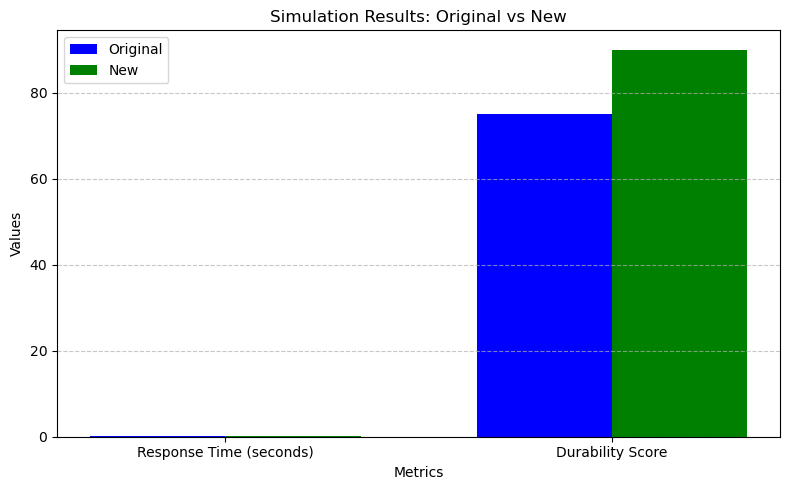

# Robotic Arm Design Simulation

### Objective
This notebook helps simulate the impact of design modifications on a robotic arm’s performance. You will:

- Test design modifications for improving response time and durability.
- Input efficiency and reinforcement factors to assess their impact.
- Visualize simulation results for response time and durability metrics.
- Document findings to support your design proposal.

### Instructions
1. **Run Setup Cells**: Load libraries and define functions necessary for simulations.
2. **Input Factors**: Enter efficiency and reinforcement factors to simulate improvements.
3. **Analyze Results**: Compare original and improved metrics using the visual output.
4. **Document Findings**: Record your observations to support your design proposal.

Ensure you use the **Design Proposal Template** to document your findings.


```python
# Import required libraries
import numpy as np  # For numerical calculations
import matplotlib.pyplot as plt  # For data visualization

# Ensure the necessary libraries are installed
try:
    import numpy
    import matplotlib
except ImportError as e:
    print(f"Missing library: {e}. Please install it using 'pip install numpy matplotlib'.")

```


```python
# Function to simulate response time improvements
def simulate_response_time(base_time, efficiency_factor):
    """Calculate the new response time based on efficiency improvements."""
    return base_time * (1 - efficiency_factor)

# Function to simulate durability improvements
def simulate_durability(base_durability, reinforcement_factor):
    """Calculate the new durability score based on reinforcement."""
    return base_durability + (base_durability * reinforcement_factor)

```


```python
# Example Base Metrics
base_response_time = 0.20  # in seconds
base_durability = 75       # durability score out of 100

# User Inputs with Validation
while True:
    try:
        efficiency_factor = float(input("Enter efficiency improvement factor (between 0 and 1, e.g., 0.15 for 15%): "))
        if 0 <= efficiency_factor <= 1:
            break
        else:
            print("Please enter a value between 0 and 1.")
    except ValueError:
        print("Invalid input. Please enter a numerical value.")

while True:
    try:
        reinforcement_factor = float(input("Enter durability reinforcement factor (between 0 and 1, e.g., 0.10 for 10%): "))
        if 0 <= reinforcement_factor <= 1:
            break
        else:
            print("Please enter a value between 0 and 1.")
    except ValueError:
        print("Invalid input. Please enter a numerical value.")

```

    Enter efficiency improvement factor (between 0 and 1, e.g., 0.15 for 15%):  .2
    Enter durability reinforcement factor (between 0 and 1, e.g., 0.10 for 10%):  .2


```python
# Simulations
new_response_time = simulate_response_time(base_response_time, efficiency_factor)
new_durability = simulate_durability(base_durability, reinforcement_factor)

# Output Results
print("\nSimulation Results:")
print(f"Original Response Time: {base_response_time} seconds")
print(f"New Response Time: {round(new_response_time, 3)} seconds")
print(f"Original Durability Score: {base_durability}")
print(f"New Durability Score: {round(new_durability, 2)}")

```

    
    Simulation Results:
    Original Response Time: 0.2 seconds
    New Response Time: 0.16 seconds
    Original Durability Score: 75
    New Durability Score: 90.0


```python
# Visual Feedback
metrics = ["Response Time (seconds)", "Durability Score"]
original_values = [base_response_time, base_durability]
new_values = [new_response_time, new_durability]

plt.figure(figsize=(8, 5))
x = np.arange(len(metrics))
width = 0.35

plt.bar(x - width/2, original_values, width, label='Original', color='blue')
plt.bar(x + width/2, new_values, width, label='New', color='green')

plt.xlabel("Metrics")
plt.ylabel("Values")
plt.title("Simulation Results: Original vs New")
plt.xticks(x, metrics)
plt.legend()
plt.grid(axis='y', linestyle='--', alpha=0.7)
plt.tight_layout()
plt.show()

```


    

    


```python
### Observations and Results
"""
Record your observations from the simulation below:

#### Initial Metrics:
- Response Time: 0.20 seconds
- Durability Score: 75

#### Improved Metrics:
- Response Time: 0.16 seconds
- Durability Score: 90

#### Key Insights:
1. How did the efficiency improvement factor impact response time?
    The efficiency factor improved the reponse time reducing it to 20%.
2. How did the reinforcement factor affect durability?
    The reinforcement factor affected durability positively by an increase of 20%.
3. Were there any trade-offs between responsiveness and durability?
    Faster reponsiveness means more use over time which buts more strain on the durability. 
    However if there are materials that can have be stronger without sacrificing weight or precisions than the trade-off can be mitigated.

#### Conclusion:
The design modifications improved both the reponse time and durability score by 20% each. 
This greatly manages potent risks to the models and improves the ability of the processing unit to operate as efficiently as possible.
"""
```


    '\nRecord your observations from the simulation below:\n\n#### Initial Metrics:\n- Response Time: 0.20 seconds\n- Durability Score: 75\n\n#### Improved Metrics:\n- Response Time: 0.16 seconds\n- Durability Score: 90\n\n#### Key Insights:\n1. How did the efficiency improvement factor impact response time?\n    The efficiency factor improved the reponse time reducing it to 20%.\n2. How did the reinforcement factor affect durability?\n    The reinforcement factor affected durability positively by an increase of 20%.\n3. Were there any trade-offs between responsiveness and durability?\n    Faster reponsiveness means more use over time which buts more strain on the durability. \n    However if there are materials that can have be stronger without sacrificing weight or precisions than the trade-off can be mitigated.\n\n#### Conclusion:\nThe design modifications improved both the reponse time and durability score by 20% each. \nThis greatly manages potent risks to the models and improves the ability of the processing unit to operate as efficiently as possible.\n'


```python

```
